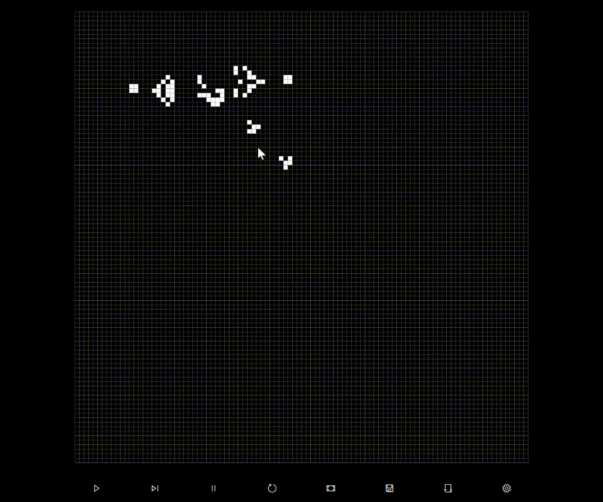
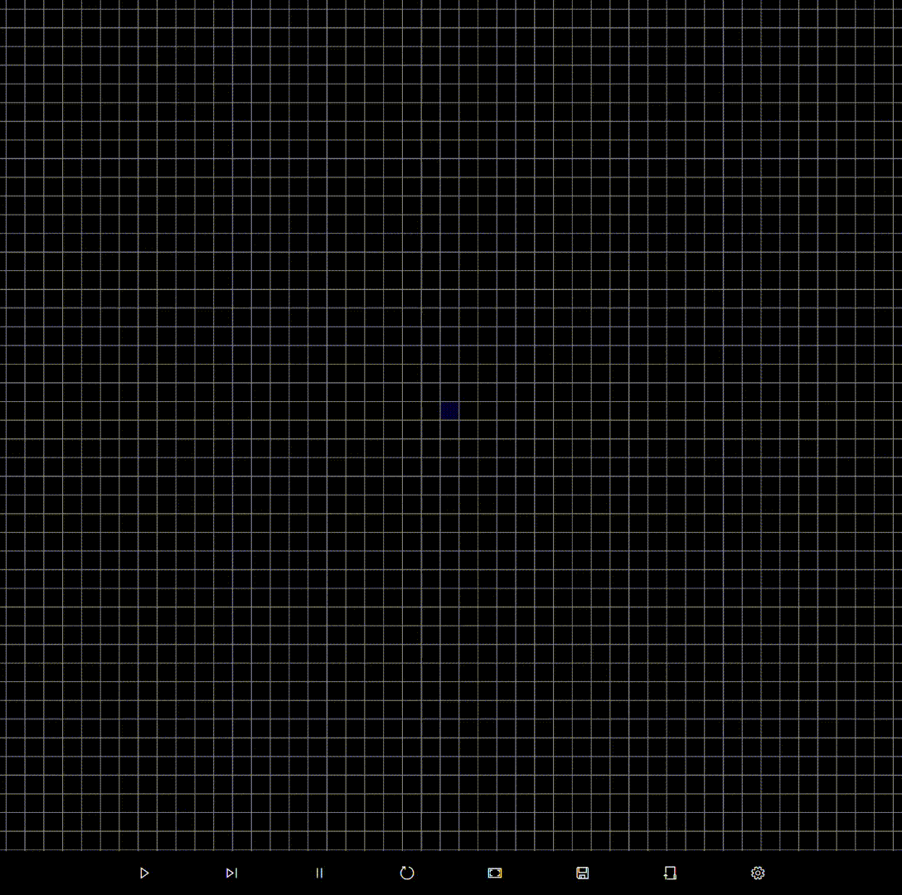
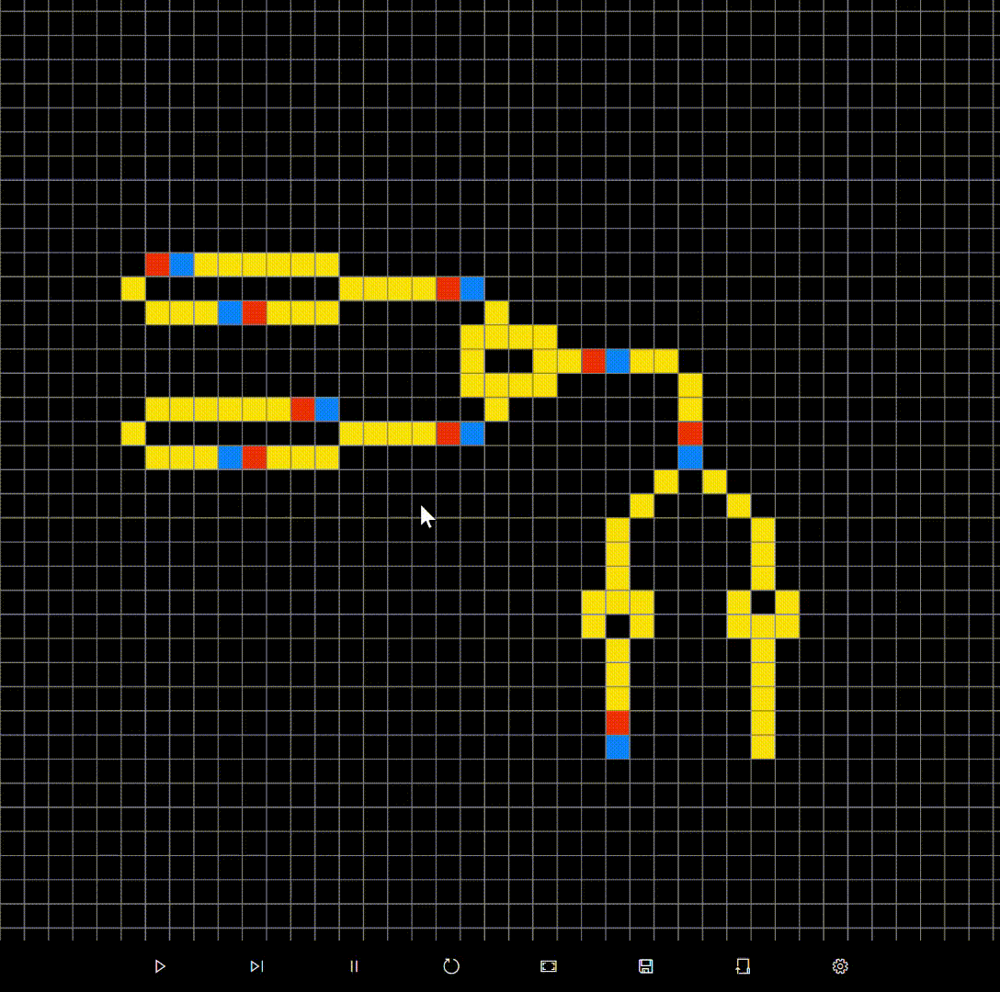

# Cellular Automaton

A [cellular automaton](https://en.wikipedia.org/wiki/Cellular_automaton) which allows the users to customize rules. Made with WPF.

This is just a toy. There are still bugs and I'm not sure I'll keep updating this project.

## Usage

To be filled.

Right click on a cell to set its state.

Load the examples inside the corresponding folder.

## Examples

### [Conway's Game of Life](https://en.wikipedia.org/wiki/Conway%27s_Game_of_Life)

### [Langton's Ant](https://en.wikipedia.org/wiki/Langton%27s_ant)

### [Wireworld](https://en.wikipedia.org/wiki/Wireworld)

